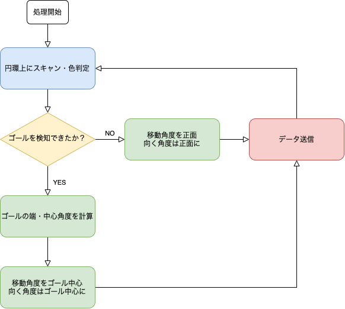

# robocup-soccer-openmv-camera-programs
__ロボカップジュニアサッカーでのopenMV CAMを用いたカメラ制御用サンプルプログラム群__

## 最初に
これらのプログラムはロボカップジュニアサッカーワールドリーグでの使用を想定して作成されています。競技ルールについては[ルールブック](https://drive.google.com/file/d/1nENPlAM84UK_o8h0x2WjepuD2egbmoI7/view)を参照して下さい。

これらのプログラムはopenMV IDE上で、micro pythonでopenMV独自のライブラリを用いて書かれたものです。そのため使う場合は[openMV IDE](https://openmv.io/pages/download)を入手することを推奨します。

近年、[全方位ミラー](https://yunit.techblog.jp/archives/70016697.html)とカメラを用いた画像認識方法がロボカップサッカーで多く使われるようになっています。このサンプルプログラム群も全方位ミラーとopenMV CAMを組み合わせて使用することを前提として作成されています。

## 機能・フローチャート
このプログラム群は以下のような特徴を持ちます。

- 今回作成したプログラムは、基本的に「ロボットの四肢」であるモーターなどの制御を行うマイコンに、ロボットの移動方向・向く方向を送信する「ロボットの脳」の役目を果たすように作成されています。そのため、プログラムは**十分な処理速度**を満たせるように作成されています。

- 機能ごとにサンプルプログラムが存在し、調整は必要ですが最終的に**自分が望む機能のみで組み上げる**ことができます。私が組み上げた例も参照できます。

以下にそれぞれのプログラムの機能・フローチャートを示します。
### ball_tracker.py
ボールを探索するプログラムです。
基本的な色認識のライブラリでボールを探索し、認識した場合はボールの位置に応じて回り込む移動角度・向く角度を送信します。このライブラリは精度は高いですが、**処理が重い**ことが難点です。そのため基本的に本当に重要な機能以外では使わないことをお薦めします。ボールの位置を推定するには自身でデータを取り、方程式を導出する必要があります。

### circular_goal_scanner.py
効率的にゴールを探索するプログラムです。
円環状にピクセルの色を読み取り、ゴールの色の閾値と比較・判定してゴールのある位置、幅を推定します。テーブルを使い、また円環状にスキャンする範囲を制限することで軽量化されています。掲載しているプログラムでは円環を3重にしていますが、何重にするかは任意で変更可能です。

### radial_enemy_scanner.py
ゴール前の敵ゴールキーパーロボットを検知し、回避するプログラムです。
circulae_goal_scanner.pyと同じプログラムでゴール範囲を特定し、ゴールの範囲を角度で等分します。分割した角度上のピクセルを画面中心からにスキャンし、それぞれの角度ごとにゴールの色を認識する距離を計測します。ゴールの色を認識できなかったか、認識するまで距離が長かった角度上に敵ロボットがいると判断します。そして最後にその敵ロボットがいる角度がゴール範囲内にもつ左右の隙間を比較し、より広い方に向かいます。

