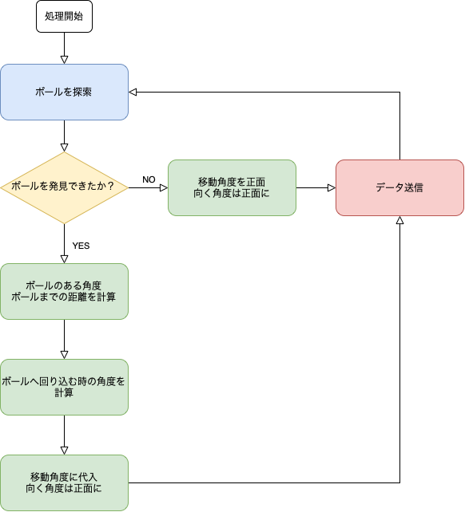

# robocup-soccer-openmv-camera-programs
__ロボカップジュニアサッカーでのopenMV CAMを用いたカメラ制御用サンプルプログラム群__

## 最初に
これらのプログラムはロボカップジュニアサッカーワールドリーグでの使用を想定して作成されています。競技ルールについては[ルールブック](https://drive.google.com/file/d/1nENPlAM84UK_o8h0x2WjepuD2egbmoI7/view)を参照して下さい。

これらのプログラムはopenMV IDE上で、micro pythonでopenMV独自のライブラリを用いて書かれたものです。そのため使う場合は[openMV IDE](https://openmv.io/pages/download)を入手することを推奨します。

## 機能・フローチャート
このプログラム群は以下のような特徴を持ちます。

- 今回作成したプログラムは、基本的に「ロボットの四肢」であるモーターなどの制御を行うマイコンに、ロボットの移動方向・向く方向を送信する「ロボットの脳」の役目を果たすように作成されています。そのため、プログラムは**十分な処理速度**を満たせるように作成されています。

- 機能ごとにサンプルプログラムが存在し、調整は必要ですが最終的に**自分が望む機能のみで組み上げる**ことができます。私が組み上げた例も参照できます。

以下にそれぞれのプログラムの機能・フローチャートを示します。
### ball_tracker.py
ボールを探索するプログラムです。

基本的な色認識のライブラリでボールを探索し、認識した場合はボールの位置に応じて回り込む移動角度・向く角度を送信します。このライブラリは精度は高いですが、**処理が重い**ことが難点です。そのため基本的に本当に重要な機能以外では使わないことをお薦めします。

### circular_goal_scanner.py
